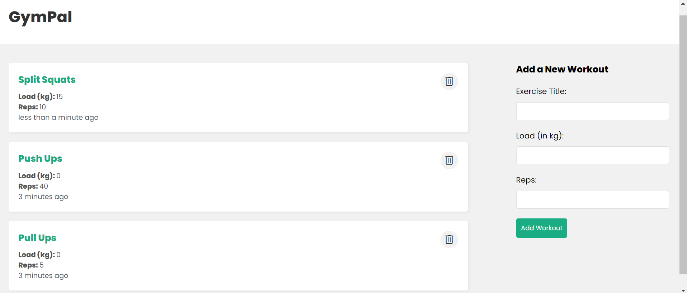

# GymPal

# Table Of Contents
- Overview
- Core Concepts
- Languages, Libraries, and Tools
- Demo

## Overview

After not being satisified with every fitness app I have tried, I decided to create my own personalized fitness tracker. The goal of this project is to create an application which I use everyday, while also gaining experience with different technologies like MongoDB, Express, React, NodeJS and techniques like API testing and System Design.

## Core Concepts

- Frontend Development
- Backend Development
- Databases
- Servers
- REST APIs
- CRUD Applications

## Languages, Libraries, and Tools

- JavaScript
- NodeJS
- MongoDB
- Express
- React
- Mongoose
- Atlas
- Postman
- Date-FNS

## Demo

- App:

You can create, read, update, and delete as many workouts as you wish. This app is a practical and user-friendly way to store all your workouts and track the progress that you are making!

